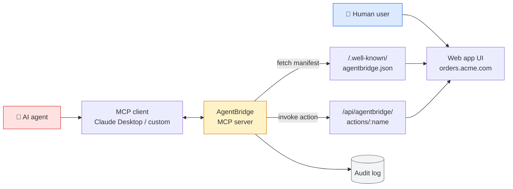
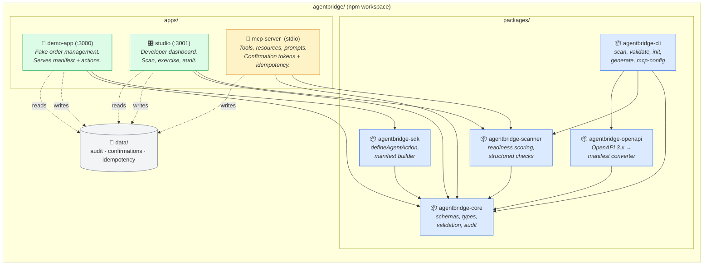
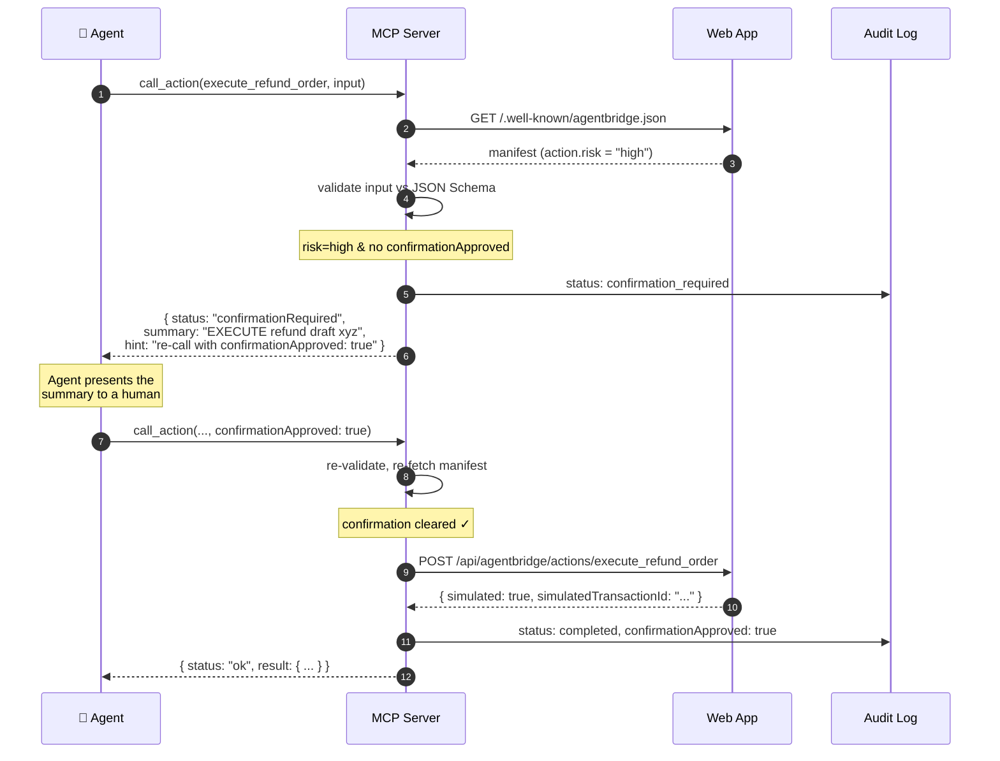

<div align="center">

# AgentBridge

### An AI-native action layer for the web.

*Web apps publish a manifest of structured, permissioned actions. AI agents discover, validate, and call those actions through MCP — instead of clicking around UIs that were designed for humans.*

[](https://github.com/marmar9615-cloud/agentbridge-protocol/actions/workflows/ci.yml)
[](LICENSE)
[](https://www.typescriptlang.org/)
[](https://nextjs.org/)
[](https://modelcontextprotocol.io)
[]()

</div>

---

## Public beta status

This is **v0.2.0 beta** — the first cut intended for outside developers to evaluate. It is suitable for local experimentation, prototyping, and reading. It is **not** yet a production security infrastructure: signed manifests, OAuth scope enforcement, HTTP MCP transport, and distributed audit storage are roadmap items (see [docs/roadmap.md](docs/roadmap.md)). Destructive demo actions remain simulated.

**Distribution: source-only.** The `@marmar9615-cloud/agentbridge-*` packages are *prepared* for npm publishing (CI builds them, `npm pack --dry-run` validates each tarball) but **have not been published to npm yet**. The way to use AgentBridge today is to clone this repo:

```bash
git clone https://github.com/marmar9615-cloud/agentbridge-protocol.git
cd agentbridge-protocol
npm install
npm run dev      # demo on :3000, Studio on :3001
```

npm publishing is a separate manual step (see [docs/npm-publishing.md](docs/npm-publishing.md)). After it happens, the equivalent commands will be:

```bash
# Available only after the packages are published — not today.
npm install @marmar9615-cloud/agentbridge-sdk @marmar9615-cloud/agentbridge-core
npx @marmar9615-cloud/agentbridge-cli scan http://localhost:3000
npx @marmar9615-cloud/agentbridge-mcp-server
```

See [docs/public-beta.md](docs/public-beta.md) for what is and isn't in 0.2.0-beta, and [docs/releases/v0.2.0-beta.md](docs/releases/v0.2.0-beta.md) for full release notes.

---

## Table of contents

- [Why agent-native interfaces matter](#why-agent-native-interfaces-matter)
- [What is AgentBridge?](#what-is-agentbridge)
- [How it works](#how-it-works)
- [Architecture](#architecture)
- [The confirmation flow](#the-confirmation-flow)
- [Quick start](#quick-start)
- [Project layout](#project-layout)
- [Packages and apps](#packages-and-apps)
- [The CLI](#the-cli)
- [OpenAPI import](#openapi-import)
- [Manifest spec](#manifest-spec)
- [Demo walkthrough](#demo-walkthrough)
- [Wire it to an MCP client](#wire-it-to-an-mcp-client)
- [Manifest schema reference](#manifest-schema-reference)
- [MCP tools reference](#mcp-tools-reference)
- [Security model](#security-model)
- [Testing](#testing)
- [Documentation](#documentation)
- [Roadmap](#roadmap)
- [Contributing](#contributing)
- [License](#license)

---

## Why agent-native interfaces matter

Today's web is built around the assumption that a human will be there — clicking, scrolling, reading visual hierarchy, dismissing modals, recovering from confusing error states. When an AI agent has to operate that same surface, it ends up driving a browser blindly:

- Inferring intent from button labels and DOM structure
- Guessing at element selectors that change between deploys
- Hoping confirmation dialogs don't appear unexpectedly
- Praying that nothing visual changes mid-flow

The result is **brittle, slow, and unsafe**. There's no reliable way for an agent — or its operator — to reason about what an action will do *before it happens*.

> ### The thesis
> Apps shouldn't force agents to operate a UI built for human eyes. Apps should publish what they actually *do* — semantically, with types, with risk metadata, with clear confirmation requirements — so agents can reason about actions before invoking them.

---

## What is AgentBridge?

AgentBridge is a **manifest format + SDK + MCP server** that lets any web app expose its operations to AI agents safely.

The core unit is a **manifest** served at a well-known URL:

```
https://your-app.com/.well-known/agentbridge.json
```

The manifest declares every action the app supports, with:

| Field | Purpose |
|---|---|
| `name`, `title`, `description` | Semantic identity an agent can reason about |
| `inputSchema` (JSON Schema) | Validate inputs before invocation |
| `outputSchema` (JSON Schema) | Tell agents what to expect back |
| `risk: low \| medium \| high` | Triage which actions need human-in-the-loop |
| `requiresConfirmation: bool` | Force an explicit approval step |
| `humanReadableSummaryTemplate` | Generate natural-language confirmation prompts |
| `permissions[]` | Document required scopes |
| `examples[]` | Teach agents the correct call shape |

An MCP server bridges any AgentBridge-enabled site to MCP-speaking agents (Claude Desktop, custom agents, etc.) with **enforcement built in**: risky actions never execute without explicit `confirmationApproved: true`, every call is audited, and outbound requests are pinned to the manifest's origin.

---

## How it works



The same web app serves two audiences:
- **Humans** see the visual UI, click around, and get rich layout
- **Agents** see the manifest, validate inputs, and invoke structured actions

Both flows share the same backend logic. Both write to the same audit log. The only difference is whether the caller is a browser or a programmatic agent.

---

## Architecture



---

## The confirmation flow

This is the heart of the safety story. Risky actions never execute on a single agent call — they require a deliberate, two-step approval.



The Studio dashboard enforces the same gate visually — the operator must type `CONFIRM` in a modal before any medium- or high-risk action runs.

---

## Quick start

```bash
git clone https://github.com/marmar9615-cloud/agentbridge-protocol.git
cd agentbridge-protocol

npm install      # pulls Next.js, MCP SDK, Zod, etc.
npm test         # all suites should pass
npm run dev      # demo on :3000, Studio on :3001
```

Then open:

- **Demo app:** http://localhost:3000 (the human surface)
- **Manifest:** http://localhost:3000/.well-known/agentbridge.json
- **Studio:** http://localhost:3001 (the dev dashboard)

To run the MCP server (stdio) for an MCP client:

```bash
npm run dev:mcp
```

**Requirements:** Node 20+, npm 10+. CI runs on Node 20.x and 22.x.

---

## Project layout

```
agentbridge-protocol/
├── packages/
│   ├── core/             # 📦 schemas, types, validation, audit
│   ├── sdk/              # 📦 defineAgentAction, manifest builder
│   ├── scanner/          # 📦 readiness scoring + structured checks
│   ├── openapi/          # 📦 OpenAPI 3.x → AgentBridge manifest converter
│   └── cli/              # 📦 @marmar9615-cloud/agentbridge-cli — scan, validate, init, generate
├── apps/
│   ├── demo-app/         # 🛒 Next.js order-management demo (port 3000)
│   ├── studio/           # 🎛 Next.js dashboard (port 3001)
│   └── mcp-server/       # 🔌 stdio MCP server: tools + resources + prompts
├── spec/
│   ├── agentbridge-manifest.schema.json   # JSON Schema for the manifest
│   ├── agentbridge-manifest.v0.1.md       # human-readable spec
│   └── examples/                          # 3 example manifests
├── examples/             # nextjs-basic · openapi-store · mcp-client-config
├── docs/                 # quickstart, mcp-client-setup, openapi-import, roadmap
├── data/                 # 📁 local audit/confirmations/idempotency (gitignored)
├── .github/workflows/    # CI
├── CLAUDE.md             # working notes for AI agents
├── CONTRIBUTING.md / SECURITY.md / CODE_OF_CONDUCT.md / CHANGELOG.md
├── README.md
└── LICENSE               # Apache 2.0
```

---

## Packages and apps

### 📦 `packages/core`

The shared contract. Everything depends on this.

```typescript
import {
  AgentBridgeManifestSchema,
  validateManifest,
  isRiskyAction,
  summarizeAction,
  createAuditEvent,
  appendAuditEvent,
} from "@marmar9615-cloud/agentbridge-core";

const result = validateManifest(rawJson);
if (result.ok) {
  for (const action of result.manifest.actions) {
    if (isRiskyAction(action)) {
      console.log("Needs confirmation:", action.name);
    }
  }
}
```

Key exports:
- **Zod schemas** for the manifest, actions, resources, permissions, audit events
- **`validateManifest(json)`** — `{ ok, manifest }` or `{ ok: false, errors[] }`
- **`isRiskyAction(action)`** — boolean confirmation gate
- **`summarizeAction(action, input)`** — fills `humanReadableSummaryTemplate` with `{{key}}` placeholders
- **`createAuditEvent`, `appendAuditEvent`, `readAuditEvents`** — JSON-file audit log with PII redaction (strips `authorization`, `cookie`, `password`, `token`, `secret` recursively)

### 📦 `packages/sdk`

The author's interface. Define actions ergonomically with Zod, get JSON Schema for free.

```typescript
import { defineAgentAction, createAgentBridgeManifest, z } from "@marmar9615-cloud/agentbridge-sdk";

const refundAction = defineAgentAction({
  name: "draft_refund_order",
  title: "Draft a refund",
  description: "Creates a refund draft. Not executed until confirmed via execute_refund_order.",
  method: "POST",
  endpoint: "/api/agentbridge/actions/draft_refund_order",
  risk: "medium",
  requiresConfirmation: true,
  inputSchema: z.object({
    orderId: z.string().min(1),
    reason: z.string().min(3),
    amount: z.number().positive(),
  }),
  outputSchema: z.object({
    draftId: z.string(),
    summary: z.string(),
  }),
  humanReadableSummaryTemplate:
    "Draft a refund of ${{amount}} on order {{orderId}} (reason: {{reason}})",
  examples: [
    {
      description: "Partial refund for a damaged item",
      input: { orderId: "ORD-1001", reason: "Damaged on arrival", amount: 24 },
    },
  ],
});

export const manifest = createAgentBridgeManifest({
  name: "Acme Order Manager",
  version: "1.0.0",
  baseUrl: "https://acme.com",
  contact: "platform@acme.com",
  actions: [refundAction /* ... */],
});
```

The SDK converts Zod → JSON Schema (via `zod-to-json-schema`) automatically, so you get one source of truth for both runtime validation and the published manifest.

### 📦 `packages/scanner`

Audit any URL for agent readiness. Returns a 0–100 score plus actionable recommendations.

```typescript
import { scanUrl } from "@marmar9615-cloud/agentbridge-scanner";

const report = await scanUrl("http://localhost:3000");
// {
//   score: 100,
//   manifestFound: true,
//   validManifest: true,
//   actionCount: 5,
//   riskyActionCount: 3,
//   missingConfirmationCount: 0,
//   issues: [],
//   recommendations: [],
// }
```

**Scoring rubric:**

| Issue | Deduction |
|---|---:|
| No manifest at all | → score 0 |
| Manifest invalid against schema | → score 10 |
| No actions declared | −30 |
| Missing `contact` field | −5 |
| Per action: short/missing description | −3 |
| Per action: no examples | −2 |
| Per action: no `humanReadableSummaryTemplate` | −2 |
| Per action: no `outputSchema` | −2 |
| Per high-risk action without `requiresConfirmation` | −15 |
| Per medium-risk action without `requiresConfirmation` | −7 |

Optionally runs a Playwright probe (`probe: true`) to fall back on visible buttons/forms when no manifest exists yet — useful for "what would an agent see if there were no manifest?" baselines.

### 🛒 `apps/demo-app`

A toy order-management Next.js app exposing **5 actions** of escalating risk:

| Action | Risk | Confirmation |
|---|---|---|
| `list_orders` | low | none |
| `get_order` | low | none |
| `draft_refund_order` | medium | required |
| `add_internal_note` | medium | required |
| `execute_refund_order` | **high** | **required** |

The demo intentionally simulates destructive actions — `execute_refund_order` mutates an in-memory store and returns `{ simulated: true, simulatedTransactionId: "..." }`. **No real payment processor is touched anywhere in this codebase.**

### 🎛 `apps/studio`

A developer dashboard at `:3001` for inspecting and exercising any AgentBridge surface:

- **Scan** — fetch + score + recommend
- **Manifest** — pretty-printed JSON viewer
- **Actions** — list with risk pills, click-through to detail
- **Action detail** — auto-generated form from `inputSchema`, "Try it" button, confirmation modal for risky actions
- **Audit log** — cross-source view (demo / studio / mcp)

### 🔌 `apps/mcp-server`

A Model Context Protocol server speaking stdio. Exposes 5 tools, 4 resources, and 4 prompts to AI agents (see [MCP tools reference](#mcp-tools-reference) below). Enforces the confirmation gate, origin pinning, URL allowlist, **confirmation tokens**, and **idempotency keys** before any outbound call.

### 📦 `packages/openapi`

OpenAPI 3.x → AgentBridge manifest converter. Used by the CLI; can also be imported directly. Resolves `$ref`s, infers risk from method, merges path/query/body params into the action's `inputSchema`. See [docs/openapi-import.md](docs/openapi-import.md) for limits.

### 📦 `packages/cli`

The `agentbridge` command. See [The CLI](#the-cli) below.

---

## The CLI

```bash
# From the repo root, no install needed:
npm run dev:cli -- scan http://localhost:3000

# After installing the published package, or via npx without install:
npx @marmar9615-cloud/agentbridge-cli scan http://localhost:3000
```

| Command | What it does |
|---|---|
| `agentbridge scan <url>` | Score the URL's AgentBridge readiness. Readable terminal output; `--json` for machine output. |
| `agentbridge validate <file-or-url>` | Validate a manifest from disk or a URL against the schema. `--json`. |
| `agentbridge init` | Scaffold an `agentbridge.config.ts` and a starter `/.well-known/agentbridge.json`. `--force` to overwrite, `--format json` for JSON config. |
| `agentbridge generate openapi <src>` | Generate a draft manifest from an OpenAPI 3.x doc. `--out PATH`, `--base-url URL`, `--json`. |
| `agentbridge mcp-config` | Print copy-pasteable MCP client configs for Claude Desktop / Cursor / others. |
| `agentbridge version` | Print CLI version. |

Example: take an existing OpenAPI document and turn it into a draft manifest in one shot:

```bash
npx @marmar9615-cloud/agentbridge-cli generate openapi ./your-api.openapi.json \
  --base-url https://api.acme.com \
  --out ./public/.well-known/agentbridge.json
```

See [docs/openapi-import.md](docs/openapi-import.md) for the full guide.

---

## OpenAPI import

The CLI's `generate openapi` command and the `@marmar9615-cloud/agentbridge-openapi` package
turn an existing OpenAPI 3.x document into a draft AgentBridge manifest.

| OpenAPI method | Risk inferred | requiresConfirmation |
|---|---|---|
| `GET` / `HEAD` | low | false |
| `POST` / `PUT` / `PATCH` | medium | true |
| `DELETE` | high | true |

The generator walks every operation, uses `operationId` (snake-cased) as the
action name, merges path/query params and request body into the action's
`inputSchema.properties`, and resolves `$ref`s against `components.schemas`.

Review every action after generation — heuristics aren't a substitute for
intent. See the [example](examples/openapi-store/) and
[docs/openapi-import.md](docs/openapi-import.md).

---

## Manifest spec

The manifest format is a stable, versioned spec — not just whatever
`@marmar9615-cloud/agentbridge-core` happens to validate.

| Artifact | Path |
|---|---|
| Human-readable spec | [`spec/agentbridge-manifest.v0.1.md`](spec/agentbridge-manifest.v0.1.md) |
| JSON Schema (Draft 2020-12) | [`spec/agentbridge-manifest.schema.json`](spec/agentbridge-manifest.schema.json) |
| Examples | [`spec/examples/`](spec/examples/) — minimal, e-commerce, support tickets |

The example manifests are validated by tests, so they stay in sync with the
schema as it evolves. Add a new example by dropping a JSON file into
`spec/examples/` and the test in `packages/core/src/tests/spec-examples.test.ts`
will pick it up automatically.

---

## Demo walkthrough

1. **Boot it up.**
   ```bash
   npm run dev
   ```

2. **Browse as a human.** Visit http://localhost:3000/orders. Click into an order. Notice this is a normal-looking app.

3. **Inspect the manifest.** Visit http://localhost:3000/.well-known/agentbridge.json (or the pretty viewer at `/manifest`). The same five operations a human can perform are declared as structured actions an agent can call.

4. **Switch to Studio.** Visit http://localhost:3001. Hit **Scan**. You should see a perfect or near-perfect score, with all 5 actions and their risk levels.

5. **Run a low-risk action.** Open `list_orders` from the Actions list. The form has a single optional `status` enum. Submit — runs immediately, returns the order list.

6. **Run a risky action.** Open `add_internal_note`. Fill in `orderId: ORD-1001` and a note. Click **Review & confirm**. The modal blocks until you type `CONFIRM`. Then it runs. Refresh the order detail page in the demo — the note is there.

7. **See the audit trail.** Visit `/audit` in either app. Both invocations appear, with the source (`studio` here), the input, and timestamps.

8. **Try refusing.** Try to invoke `execute_refund_order` from the MCP server without `confirmationApproved`:
   ```bash
   echo '{"jsonrpc":"2.0","id":1,"method":"initialize","params":{"protocolVersion":"2024-11-05","capabilities":{},"clientInfo":{"name":"smoke","version":"0"}}}
   {"jsonrpc":"2.0","method":"notifications/initialized"}
   {"jsonrpc":"2.0","id":2,"method":"tools/call","params":{"name":"call_action","arguments":{"url":"http://localhost:3000","actionName":"execute_refund_order","input":{"draftId":"x","confirmationText":"CONFIRM"}}}}' \
     | npm run dev:mcp 2>/dev/null
   ```
   You'll get back `{ "status": "confirmationRequired", "summary": "EXECUTE refund draft x (irreversible in real life)", ... }` — the action endpoint is **not** called.

---

## Wire it to an MCP client

### Claude Desktop

Edit `~/Library/Application Support/Claude/claude_desktop_config.json` (macOS):

```json
{
  "mcpServers": {
    "agentbridge": {
      "command": "npx",
      "args": ["@marmar9615-cloud/agentbridge-mcp-server"]
    }
  }
}
```

Restart Claude Desktop. You should see `agentbridge` show up in the tools panel with 5 tools available.

### Conversation example

> **You:** What can the app at http://localhost:3000 do?
>
> **Claude:** *(uses `discover_manifest`)* It's a Demo Order Manager v0.1.0 with 5 actions: list_orders (low risk), get_order (low), draft_refund_order (medium, needs confirmation), execute_refund_order (high, needs confirmation), and add_internal_note (medium, needs confirmation).
>
> **You:** Refund order ORD-1001 for $24 because the customer reported damage.
>
> **Claude:** *(uses `call_action` for `draft_refund_order`)* I've drafted the refund. Draft id `draft_xxx`. To execute it, I need explicit approval — should I proceed?
>
> **You:** Yes, go ahead.
>
> **Claude:** *(uses `call_action` for `execute_refund_order` with `confirmationApproved: true`)* Done. Simulated transaction `sim_tx_yyy`. Order ORD-1001 is now in `refunded` status.

---

## Manifest schema reference

A complete example manifest:

```json
{
  "name": "Demo Order Manager",
  "description": "A fake order management app exposing structured AgentBridge actions for AI agents.",
  "version": "0.1.0",
  "baseUrl": "http://localhost:3000",
  "contact": "demo@agentbridge.local",
  "auth": { "type": "none", "description": "Demo only — no auth." },
  "resources": [
    {
      "name": "orders",
      "description": "Customer orders with items, status, notes, and refund history.",
      "url": "/orders"
    }
  ],
  "actions": [
    {
      "name": "execute_refund_order",
      "title": "Execute a drafted refund",
      "description": "Executes a previously drafted refund. SIMULATED.",
      "method": "POST",
      "endpoint": "/api/agentbridge/actions/execute_refund_order",
      "risk": "high",
      "requiresConfirmation": true,
      "inputSchema": {
        "type": "object",
        "required": ["draftId", "confirmationText"],
        "properties": {
          "draftId": { "type": "string", "minLength": 1 },
          "confirmationText": { "type": "string", "minLength": 1 }
        }
      },
      "outputSchema": {
        "type": "object",
        "properties": {
          "simulated": { "const": true },
          "simulatedTransactionId": { "type": "string" }
        }
      },
      "permissions": [],
      "examples": [
        {
          "description": "Execute the refund draft after confirmation",
          "input": { "draftId": "draft_xxx", "confirmationText": "CONFIRM" }
        }
      ],
      "humanReadableSummaryTemplate": "EXECUTE refund draft {{draftId}} (irreversible in real life)"
    }
  ],
  "generatedAt": "2026-04-27T02:05:06.203Z"
}
```

**Top-level fields:** `name`, `description`, `version`, `baseUrl`, `resources[]`, `actions[]`, `auth`, `contact`, `generatedAt`.

**Action fields:** `name`, `title`, `description`, `inputSchema` (JSON Schema), `outputSchema` (JSON Schema), `method`, `endpoint`, `risk` (`low | medium | high`), `requiresConfirmation`, `permissions[]`, `examples[]`, `humanReadableSummaryTemplate`.

---

## MCP tools reference

The MCP server exposes **5 tools, 4 resources, and 4 prompts**. All accept a target `url` (the origin of an AgentBridge-enabled app).

### Tools

| Tool | Purpose |
|---|---|
| **`discover_manifest`** | Fetch + summarize a manifest. Use first to understand what an app supports. |
| **`scan_agent_readiness`** | Run the full scanner; returns 0–100 score, structured `checks[]`, grouped recommendations. |
| **`list_actions`** | Compact list of actions with name, title, risk, confirmation flag, permissions. |
| **`call_action`** | Invoke an action. Risky actions return `confirmationRequired` plus a `confirmationToken`; the second call must include `confirmationApproved: true` AND the same token. Optional `idempotencyKey` replays prior results. |
| **`get_audit_log`** | Read recent audit events; filter by `url`. |

### Resources

URIs the agent can fetch directly:

| URI | What it returns |
|---|---|
| `agentbridge://manifest?url=<encoded>` | The validated manifest at the given URL. |
| `agentbridge://readiness?url=<encoded>` | Full scanner report (score, checks, recommendations). |
| `agentbridge://audit-log?url=<encoded>&limit=N` | Recent audit events, optionally filtered. |
| `agentbridge://spec/manifest-v0.1` | Bundled human-readable manifest spec (markdown). |

### Prompts

Reusable agent prompts:

| Prompt | Use case |
|---|---|
| `scan_app_for_agent_readiness` | Audit + write up findings for an AgentBridge surface. |
| `generate_manifest_from_api` | Turn an OpenAPI doc or API description into a draft manifest. |
| `explain_action_confirmation` | Translate an action for a human reviewer about to approve it. |
| `review_manifest_for_security` | Safety-focused review of an existing manifest. |

### Example: full call_action transaction (with token + idempotency)

```jsonc
// First call — no confirmation, no token yet
{
  "tool": "call_action",
  "arguments": {
    "url": "http://localhost:3000",
    "actionName": "execute_refund_order",
    "input": { "draftId": "draft_xxx", "confirmationText": "CONFIRM" }
  }
}

// Response: gated, no upstream call made; token returned
{
  "status": "confirmationRequired",
  "summary": "EXECUTE refund draft draft_xxx (irreversible in real life)",
  "action": { "name": "execute_refund_order", "risk": "high", "requiresConfirmation": true },
  "confirmationToken": "f1c2…",
  "confirmationExpiresInSeconds": 300,
  "hint": "Re-call this tool with confirmationApproved: true AND the same confirmationToken after a human reviews the summary."
}

// Second call — explicit approval + token (single-use, input-bound)
{
  "tool": "call_action",
  "arguments": {
    "url": "http://localhost:3000",
    "actionName": "execute_refund_order",
    "input": { "draftId": "draft_xxx", "confirmationText": "CONFIRM" },
    "confirmationApproved": true,
    "confirmationToken": "f1c2…",
    "idempotencyKey": "ord-1001-refund-2026-04-27"
  }
}

// Response: action ran, simulated
{
  "status": "ok",
  "result": {
    "simulated": true,
    "simulatedTransactionId": "sim_tx_1777255529536",
    "executedAt": "2026-04-27T02:05:29.536Z"
  },
  "idempotent": { "key": "ord-1001-refund-2026-04-27", "replayed": false }
}
```

A repeat call with the same `idempotencyKey` and same input returns the
cached result without re-invoking the upstream endpoint. A repeat with the
same key and **different** input is rejected as a conflict.

---

## Security model

This is an MVP — but security is not an afterthought, because the entire value of the project is letting agents act safely.

### Enforced today

| Control | Where it lives | What it does |
|---|---|---|
| **URL allowlist** | `mcp-server/src/safety.ts`, `scanner/src/scanner.ts` | Only loopback URLs by default. Override with `AGENTBRIDGE_ALLOW_REMOTE=true`. |
| **Origin pinning** | `mcp-server/src/safety.ts:assertSameOrigin` | Action endpoints must share origin with `manifest.baseUrl`. A poisoned manifest cannot redirect calls elsewhere. |
| **Confirmation gate** | `mcp-server/src/tools.ts:callAction`, `studio/api/call/route.ts` | Risky actions return `confirmationRequired` unless caller passes `confirmationApproved: true`. |
| **Confirmation tokens** | `mcp-server/src/confirmations.ts` | Tokens are bound to `(url, actionName, hash(input))`, single-use, expire in 5 minutes. Reuse with different input is rejected. |
| **Idempotency keys** | `mcp-server/src/idempotency.ts` | Optional per-call key replays prior result; same key + different input is a conflict. |
| **Outbound timeout + size cap** | `mcp-server/src/tools.ts` | 10s timeout on action calls; 1MB response body cap. |
| **Schema validation** | `mcp-server/src/tools.ts` (Ajv), SDK (Zod) | Inputs validated against the action's JSON Schema before any upstream call. |
| **Audit redaction** | `core/src/audit.ts:redact` | Strips `authorization`, `cookie`, `password`, `token`, `secret`, `api_key` recursively before persisting. |
| **Simulated destructive actions** | `demo-app/lib/orders.ts` | No real payment processor is wired anywhere. All "destructive" demo actions return `{ simulated: true, ... }`. |
| **Bounded audit log** | `core/src/audit.ts` | Capped at 500 most recent events; atomic write (tmp + rename) to prevent corruption. |

### Not yet implemented (search for `// PROD:` in the source)

- Real OAuth/bearer auth on the MCP server and on action endpoints
- Per-action RBAC and tenant isolation
- **Signed manifests** so agents can verify the publisher
- Policy engine integration (OPA / Cedar) for action-level allow/deny
- Rate limiting and cost accounting
- Distributed audit storage (the MVP uses a local JSON file)

### Threat model summary

| Threat | Mitigation today | Long-term mitigation |
|---|---|---|
| Agent misclicks a destructive action | Confirmation gate + risk metadata | Same + signed policy contracts |
| Poisoned manifest redirects calls to attacker host | Origin pinning to `baseUrl` | Same + signed manifests + cert pinning |
| SSRF via attacker-supplied URL | Loopback-only by default | Same + outbound-host allowlist per agent |
| Audit log leaks secrets | Recursive redaction of common keys | Same + structured logging w/ tagged sensitive fields |
| Agent DOS's the upstream app | (none today) | Per-tool rate limiting + cost accounting |

---

## Testing

```bash
npm test          # all suites
npm run typecheck # per-package tsc --noEmit
npm run build     # tsup build for publishable packages
npm run pack:dry-run # validate published-tarball contents
```

**Coverage:**

- `packages/core` — manifest validation, risk classification, summary template rendering, audit log persistence + redaction, spec example validation.
- `packages/scanner` — scoring, structured checks, URL allowlist enforcement, cross-origin baseUrl, destructive-method detection.
- `packages/openapi` — OpenAPI parsing, risk inference, name normalization, $ref resolution, full fixture conversion.
- `packages/cli` — arg parsing, exit codes, validate/init/generate behaviour, file system side effects.
- `apps/mcp-server` — confirmation gate, **token issuance + binding + single-use**, **idempotency replay + conflict**, origin pinning, JSON Schema validation, low-risk pass-through.

CI runs `npm install`, typecheck, all tests, and Next.js builds on Node 20.x and 22.x — see [`.github/workflows/ci.yml`](.github/workflows/ci.yml).

---

## Documentation

| Doc | What it covers |
|---|---|
| [docs/quickstart.md](docs/quickstart.md) | Five-minute walkthrough from clone to running stack. |
| [docs/mcp-client-setup.md](docs/mcp-client-setup.md) | Hooking AgentBridge MCP into Claude Desktop, Cursor, custom clients. |
| [docs/openapi-import.md](docs/openapi-import.md) | Generating manifests from OpenAPI 3.x. |
| [docs/roadmap.md](docs/roadmap.md) | What's shipped, what's next. |
| [spec/agentbridge-manifest.v0.1.md](spec/agentbridge-manifest.v0.1.md) | The manifest specification. |
| [CLAUDE.md](CLAUDE.md) | Working notes for AI agents operating on this codebase. |
| [CONTRIBUTING.md](CONTRIBUTING.md), [SECURITY.md](SECURITY.md), [CODE_OF_CONDUCT.md](CODE_OF_CONDUCT.md) | Community + reporting. |
| [CHANGELOG.md](CHANGELOG.md) | Per-release notes. |

---

## Roadmap

Near-term, in rough priority order:

- **Signed manifests.** A published manifest carries a publisher signature an agent can verify offline. Removes the need to trust the host you're talking to.
- **Standardized risk taxonomy.** Move from `low | medium | high` to a richer model: `read`, `write-self`, `write-others`, `financial`, `irreversible`. Lets agents reason about action consequences more precisely.
- **Policy primitives.** First-class support for cost caps, rate limits, business-hours gating, and N-of-M approver workflows declared *in the manifest*.
- **HTTP MCP transport.** stdio works for desktop clients; production agents need an authenticated HTTP transport.
- **Cross-app workflows.** Let an agent compose actions from multiple AgentBridge surfaces with consistent confirmation semantics across them.
- **Browser fallback + auto-generation.** When a site doesn't publish a manifest, run a Playwright probe and *generate* a starter manifest from visible buttons and forms — give app teams a one-click on-ramp.
- **Manifest registry.** Optional public index of manifests so agents can discover what surfaces exist for a given task ("find me an app that can refund a Stripe charge").

---

## Contributing

This is a prototype, and the most valuable contributions are about the **interface contract** between agents and apps — not the demo Next.js plumbing.

High-leverage places to start:

1. **`packages/core/src/schemas.ts`** — the manifest schema is the entire contract. Field additions, deprecations, and tightening live here.
2. **`packages/scanner/src/score.ts`** — the readiness rubric. What does a "good" agent-ready app look like? Should missing examples cost more than missing output schemas?
3. **`apps/mcp-server/src/tools.ts`** — the enforcement surface. The confirmation gate and origin pinning are critical paths.

Please open an issue before starting on any PR larger than a small fix, so we can align on direction.

---

## License

Apache License 2.0 — see [LICENSE](LICENSE).

---

<div align="center">

Built as an MVP exploration of the **agent-native interface layer** for the web.

If this resonates, [open an issue](https://github.com/marmar9615-cloud/agentbridge-protocol/issues) and let's talk.

</div>
